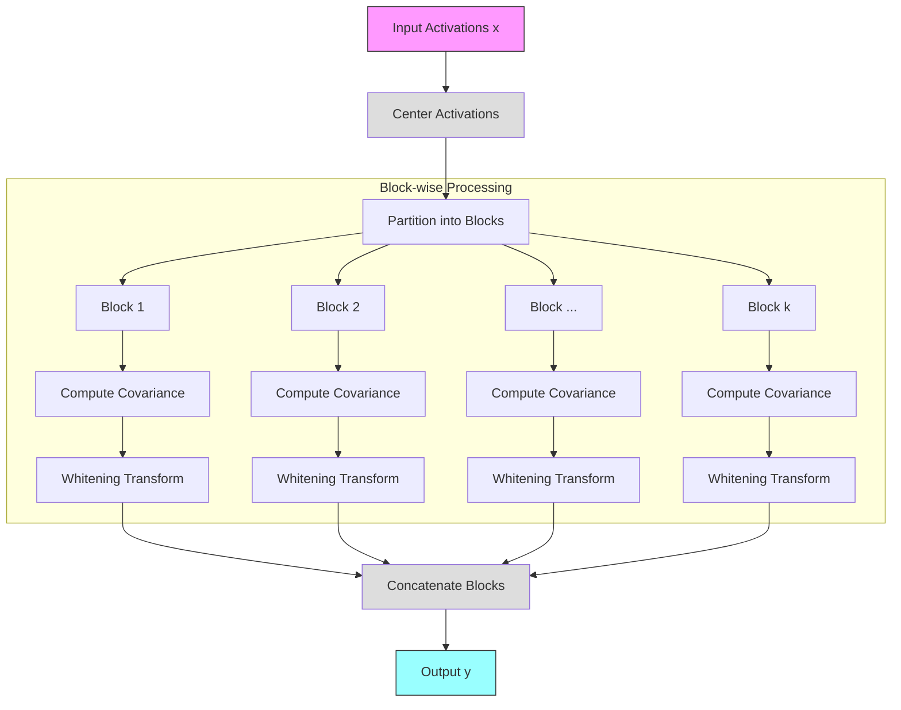
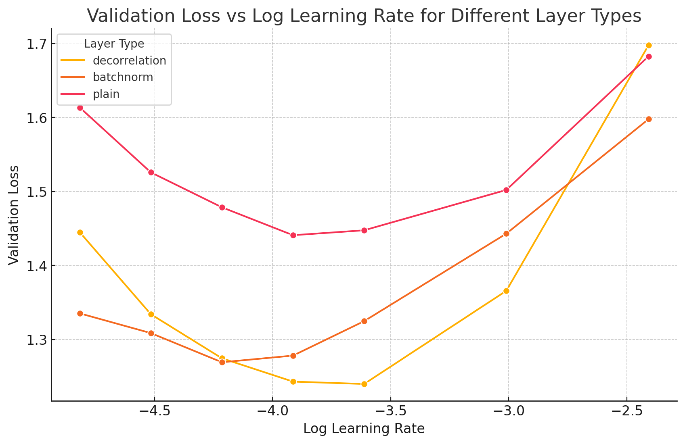
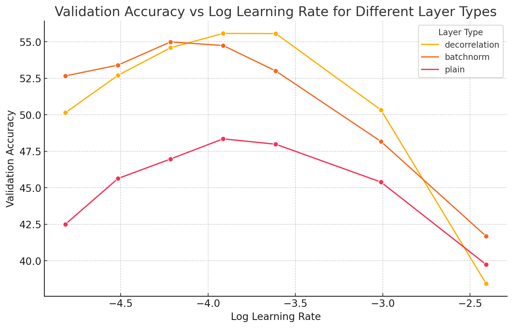

# 🧠 Block-wise Decorrelation Layer Experiments

This repository contains experiments with block-wise decorrelation layers in neural networks, comparing them with batch normalization and plain architectures.

## 📝 Description

This project implements a novel block-wise decorrelation layer that efficiently whitens neural network activations by operating on smaller feature blocks. While traditional whitening approaches like full decorrelation, our approach reduces computational complexity through block-wise processing while maintaining most of the benefits of decorrelation. This is similar to how Shampoo optimizer uses block-diagonal preconditioning matrices in parameter space during optimization.

### 🔬 Mathematical Details & Relationship to Shampoo

The block-wise decorrelation layer performs the following transformation:




Given input activations $x \in \mathbb{R}^{B \times D}$ where B is batch size and D is feature dimension:

1. Center the activations:
   $$\hat{x} = x - \mathbb{E}[x]$$

2. Partition features into blocks of size k and compute block-wise running covariance:
   $$\Sigma_t^{(i)} = (1-\alpha)\Sigma_{t-1}^{(i)} + \alpha\left(\frac{1}{B-1}\hat{x}_i^T\hat{x}_i\right)$$
   where $\alpha$ is momentum and $i$ indexes blocks.

3. Compute block-wise whitening transformation:
   $$W^{(i)} = (\Sigma^{(i)})^{-\frac{1}{2}} = Q^{(i)}(\Lambda^{(i)})^{-\frac{1}{2}}(Q^{(i)})^T$$
   where $Q^{(i)}\Lambda^{(i)}(Q^{(i)})^T$ is the eigendecomposition of $\Sigma^{(i)} + \epsilon I$

4. Apply block-wise transformation:
   $$y_i = W^{(i)}\hat{x}_i$$

5. Concatenate blocks:
   $$y = [y_1, y_2, \ldots, y_k]$$

Similar to Shampoo optimizer which uses block-diagonal preconditioning matrices, our approach reduces complexity from $O(D^3)$ to $O(D/k \cdot k^3)$ while maintaining most decorrelation benefits. However, while Shampoo applies this in parameter space during optimization, we operate directly on activations during forward propagation.

## 🚀 Usage

```bash
python run.py --layer-type decorrelation \
              --block-size 64 \
              --update-every 4 \
              --num-epochs 10 \
              --learning-rate 0.001 \
              --wandb-project "my_project"
```

### Parameters

- `layer_type`: Choose between `plain`, `batchnorm`, or `decorrelation`
- `block_size`: Size of the block for decorrelation layer
- `update_every`: Number of epochs between updates
- `num_epochs`: Number of epochs to train
- `learning_rate`: Learning rate for the optimizer
- `wandb_project`: Name of the Weights & Biases project

## 📊 Initial Results

### CIFAR-10

I gave this a shot on CIFAR-10 with a 3-layer MLP.

<center>


</center>

Not bad tbh!

## 📚 References

There are a few papers that are related to this work:
- [Shampoo](https://arxiv.org/abs/1802.09568)
- [Decorrelated Batch Normalization](https://arxiv.org/abs/1804.08450)
- [Stochastic Whitening](https://arxiv.org/abs/2106.04413)